# National Park

National Parks and Wilderness Areas for Sid Meier's Civilization VII, from the Exploration Age on. Found one on an
empty, Charming tile a city or town owns, then grow it tile by tile, choosing which wild land to protect: mountains,
forests, lakes, rivers, the sea, natural wonders and open country.

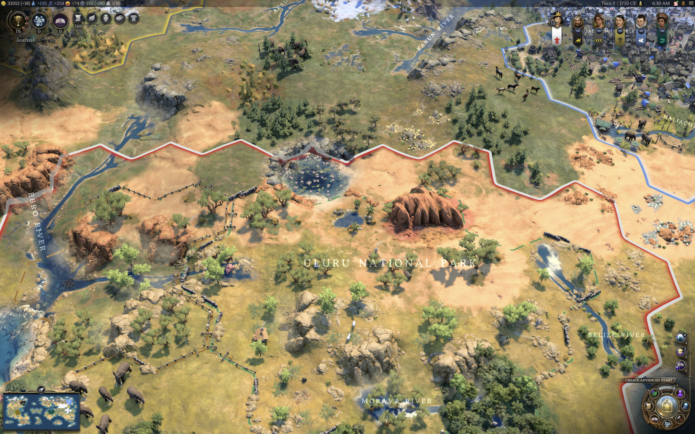

## What it does

- **Found a park.** A city runs **Found National Park**, or a city or town buys it for Gold from its purchase list,
  once the Society civic (Exploration Age) or Natural History (Modern Age) is done. Then press **Choose land** and
  pick an empty, Charming flat or hill tile the settlement owns, in any ring: nothing built on it, no farm, no
  district. Only those tiles light up. A resource on it stays collected. The founding tile gives +4 Happiness, plus +5
  Happiness and +5 Culture for each adjacent natural wonder. One per settlement.
- **Or leave it wild.** The Wilderness Area is the park's twin, founded and grown the same way and unlocked by the
  same civics, but paid in Influence: +4 Influence, plus +10 Influence for each adjacent natural wonder. It has no
  lodge, cabins or lookout, only the land and its wildlife, inside an ocher border. A settlement can have one National
  Park and one Wilderness Area.
- **Grow it.** A city with a park can run **Expand National Park** (or **Expand Wilderness Area**), again and again,
  always at the same cost. Any settlement with a park, town or city, can instead buy an expansion for Gold from its
  purchase list, where Expand National Park and Expand Wilderness Area are listed with their price. Each expansion
  adds land beside the park, 1 tile in the Exploration Age and 3 in the Modern Age.
- **Choose the land.** When an expansion completes, a Choose land button appears at the top of the screen; after
  buying one with Gold, the picker opens at once. The lit tiles on the map are the ones the park can take. Click tiles
  to select them, then Confirm. Done adds what you selected and ends the expansion; Later keeps the rest for another
  turn, and Choose land brings the picker back. If no land is free when an expansion completes, you are told, and the
  tiles wait until land is free. Tiles you have not placed carry over into the next age. A park grows to 24 tiles; the
  picker tells you when your choice fills it, and the project is then grayed out in that city. Land past the third
  ring (bought, or claimed by a mod such as Cultural Diffusion) can join and pays like any other.
- **Park yields.** A tile that joins a park keeps its own yields (Food, Production and so on) and gives the park's on
  top: +1 Culture and +1 Happiness in a National Park, +3 Influence in a Wilderness Area. Park tiles don't need a
  citizen to work them, and the yields layer shows their yields on the map.
- **Size bonuses.** Each National Park and Wilderness Area earns more as it reaches 8, 16 and 24 tiles of its own, on
  every tile: a National Park tile gives +2 Culture +1 Happiness at 8, +2 Culture +2 Happiness at 16 and +3 Culture +2
  Happiness at 24; a Wilderness Area tile gives +4, +5 and then +6 Influence. Land lost or built over counts against
  it, and the tiles step back down.
- **Charming land.** A park is founded where the game's own appeal, as the appeal lens and tile tooltip show it, is
  Charming (3 or more): neighbouring mountains, coast, navigable rivers, woods and natural wonders raise it. The land a
  park grows over can be any it may take, and a tile whose appeal later falls stays in the park.
- **What a park can take.** Any rural land you own beside the park: open land, forest, mountains, lakes, rivers, the
  open sea and natural wonders. Resources come with the land: a tile with a resource joins without a question and its
  resource stays collected, the park taking over from the plantation, camp or fishing boat that harvested it. A tile
  with a farm or other improvement and no resource joins after you confirm; the improvement is removed, and the
  citizen who worked it comes back as new population for you to place. An Expedition Base stays where it is and keeps
  working its mountain or wonder. Urban districts and buildings are never taken.
- **Protected land.** Park land cannot be developed. No settlement, yours or the AI's, can build on it or grow into
  it: the game offers park land to no building and no farm. Urban development is never removed: if a building ever
  lands on park land anyway, that tile leaves the park, and if it is the founding tile, the park moves its founding
  improvement to another of its tiles, beside the natural wonder where it can.
- **It looks like a park.** The park is drawn from the game's own art, suited to its land: woods that fill its forest
  tiles edge to edge, stands of trees with a flowering accent, stones and cairns on hills, lily pads and reeds on a
  lake, reeds along a river, a rowboat now and then, a warden's station on the founding tile, and a lookout tower once
  the park has grown. As a park reaches 8, 16 and 24 tiles it is drawn richer, with more campsites, cabin villages and
  lookouts in a National Park, thicker woods and meadow in a Wilderness Area, more animals in both, and monuments
  scattered over its land: stone cairns from 8 tiles, obelisks (dolmens in a Wilderness Area) from 16. These are
  spread over the park so that neighboring tiles differ: no two tiles side by side carry the same flock, school of
  fish, herd, reeds or lily pads. Low dry-stone walls, with stretches of stone-and-timber fence, run along most of its
  land edges in broken, uneven runs, the way walls line a scenic parkway; water gets no walls, only a buoy where the
  park's water meets the open sea. A dashed green border marks exactly which land is park, and new land joins with its
  walls going up one run at a time.
- **It is alive.** Animated wildlife suited to each tile: bison and horses on the plains, elk in the tundra, camels
  in the desert, elephants and cranes in the jungle, sheep and llamas on the hills, deer and foxes almost anywhere,
  cranes on the shores and crabs on the coast. Overhead, birds and butterflies; in lakes, leaping and swimming fish;
  at sea, gulls, schools of fish, reef fish along the shore and now and then a whale.
- **See them all at a glance.** The **Parks and Wilderness** lens in the lens menu shades every park tile you can
  see: National Parks in green, Wilderness Areas in ocher, the founding tile a little deeper.
- **Named for its place.** A new park is named after a natural wonder beside it: "Uluru National Park", "Redwood
  Forest Wilderness Area". Otherwise, or if that name is taken, it takes the name of a river or other place within two
  tiles, or of its settlement. Rename it with the Rename button in the park's picker.
- **AI parks grow too.** An AI founds parks with its own Gold, usually beside a natural wonder, and buys its park an
  expansion with its own Gold when it is worth it: at peace, with Gold coming in, and when the land it would take pays
  the price back soon enough. It saves for one out of its income. An AI park adds land on its own, favoring wonders
  and mountains, and never takes a tile that would cost it an improvement.
- **Parks change hands with their settlement.** A conquered settlement's park goes to its new owner, land and all. A
  park tile that passes to another player on its own leaves the park and is left as it is.

## Civilopedia

The Civilopedia has a **National Parks** section (14 pages in five groups: Getting Started, Founding & Growth, Park
Land, On the Map, Lens & Options) explaining every rule. Under Game Concepts, a **Parks and Wilderness** group covers
national parks and wilderness areas in the real world: their history in the United States, parks around the world,
the IUCN categories, and websites for further reading.

## Translations

The game text and the Civilopedia are in English, German, Spanish, French, Italian, Japanese, Korean, Polish, Portuguese
(Brazil), Russian, and Simplified and Traditional Chinese, the game's own languages. The translations are machine
translations that use the game's own words for its terms; corrections from native speakers are welcome. To fix or add a
language, see [`text/README.md`](text/README.md).

## Options

Under **Options ▸ Add-ons ▸ National Park**, from the main menu or in a game:

- **Show park borders and shading** (on by default): draws every National Park's green and every Wilderness Area's
  ocher border with a light shading of its land, whatever lens is on, and turns both off together. The Parks and
  Wilderness lens shades them more strongly. Applies at once.
- **Parks and Wilderness lens** (on by default): lists the lens in the lens menu. A change shows the next time the
  lens menu opens.

Both are kept from one game to the next.

## With Geographic Labels

National Park works on its own. With [Geographic Labels](https://steamcommunity.com/sharedfiles/filedetails/?id=3759067376)
installed as well, version 1.6.0 or later:

- each park's name is drawn on the map over its land, like any other place; from Geographic Labels 1.6.1, a park
  named after the wonder beside it is drawn in place of the wonder's label;
- parks are listed in Geographic Labels' Rename Places under "Park or wilderness", and the picker's Rename button
  opens it there;
- a new park can also take its name from a mountain range, lake or region the labels know within two tiles.

With Geographic Labels 1.5.0 or earlier, or without it, park names appear in the picker and prompt, and the picker's
Rename button opens National Park's own rename box.

## Screenshots

| | |
| --- | --- |
| 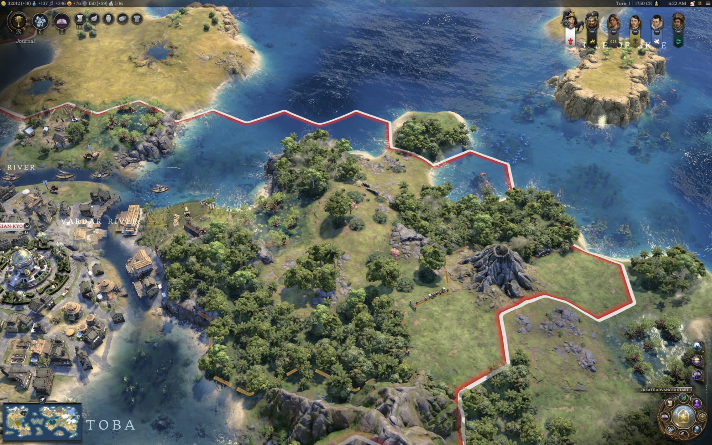 | 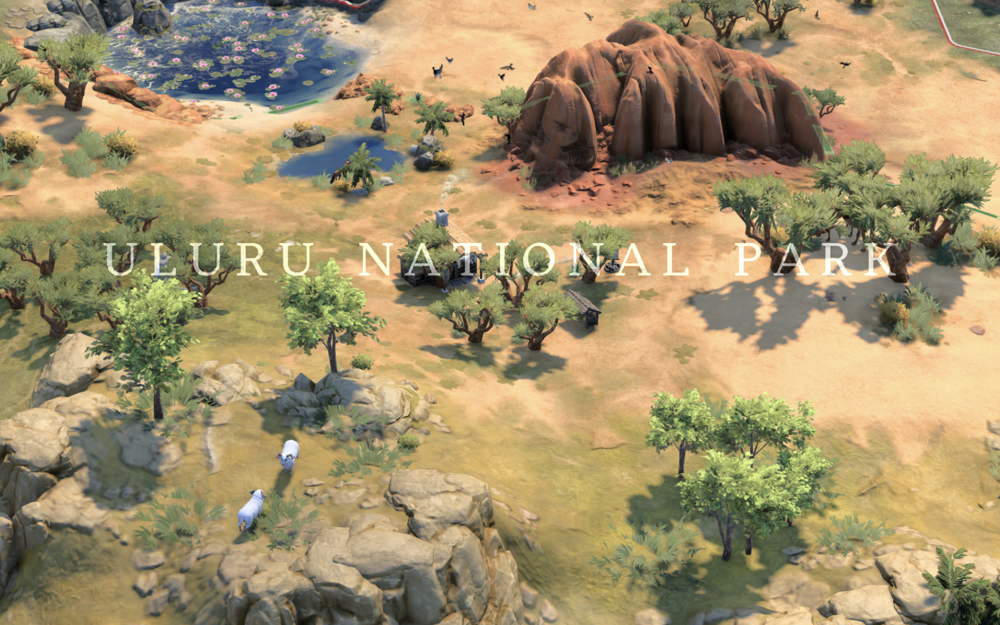 |
| 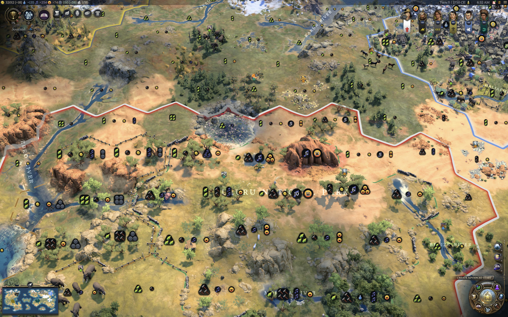 | 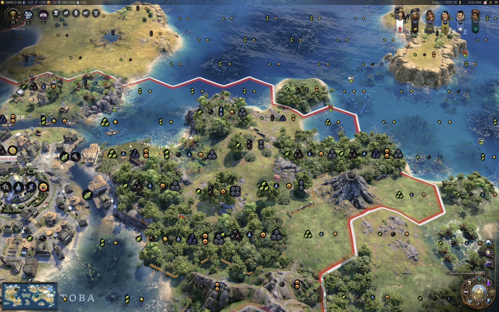 |
| 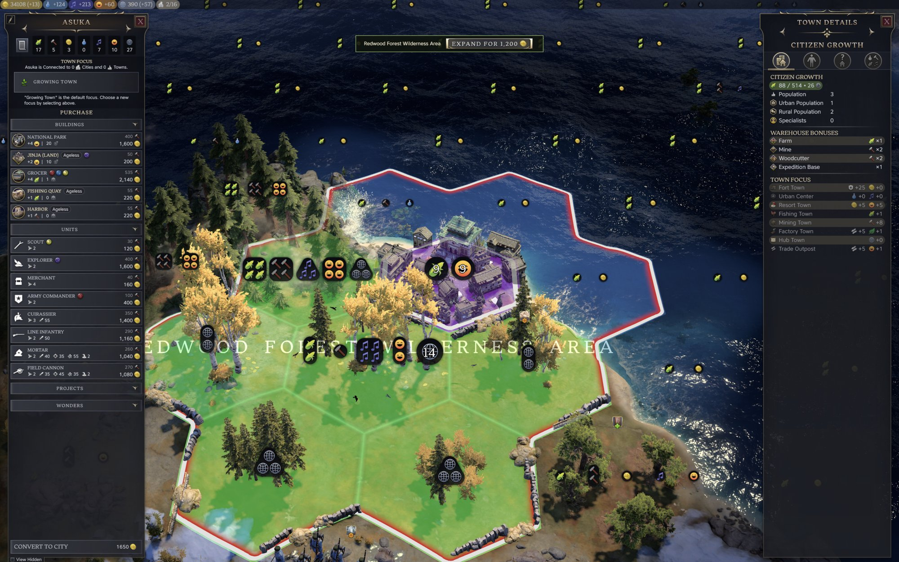 | 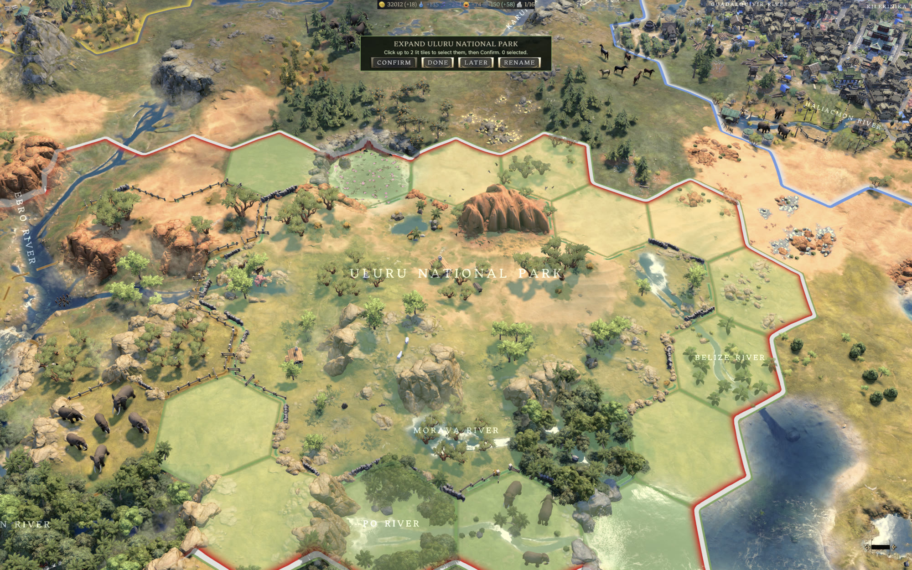 |
| 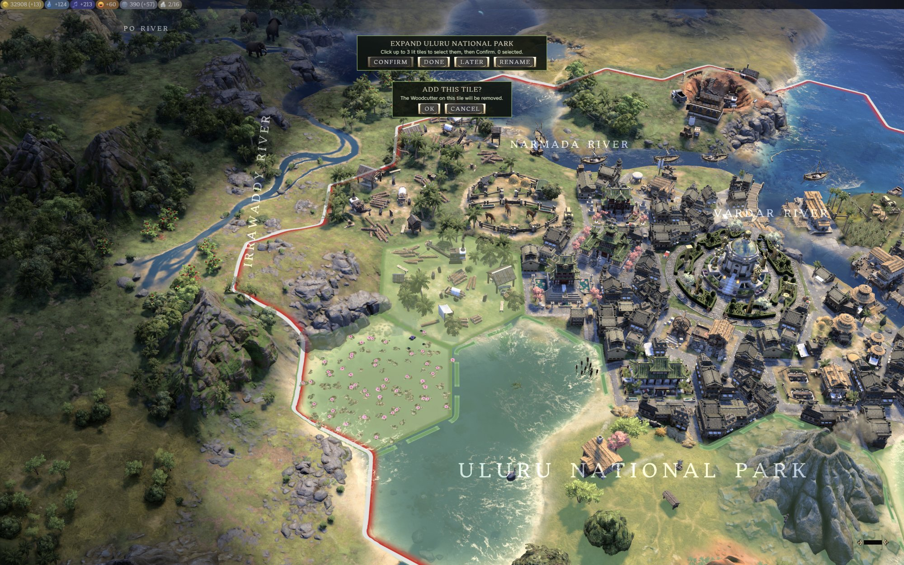 | 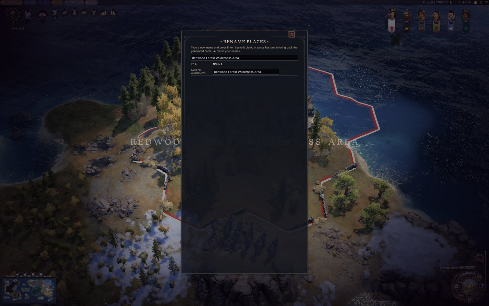 |
| 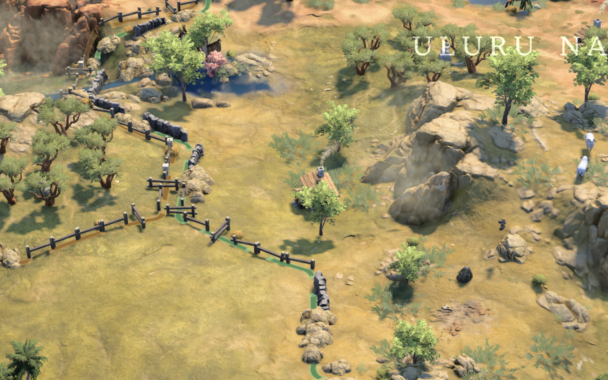 | 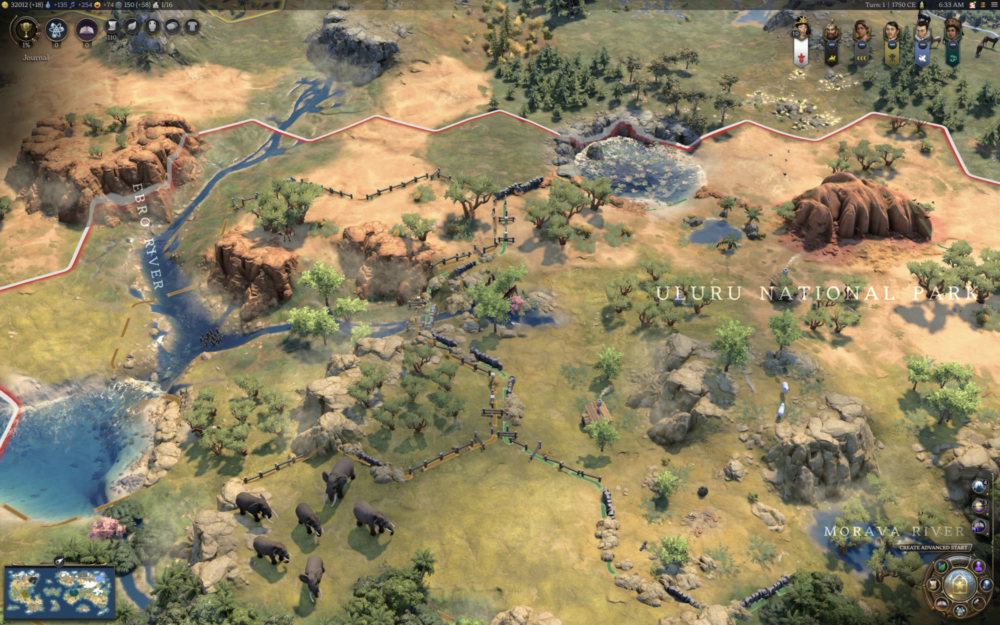 |
| 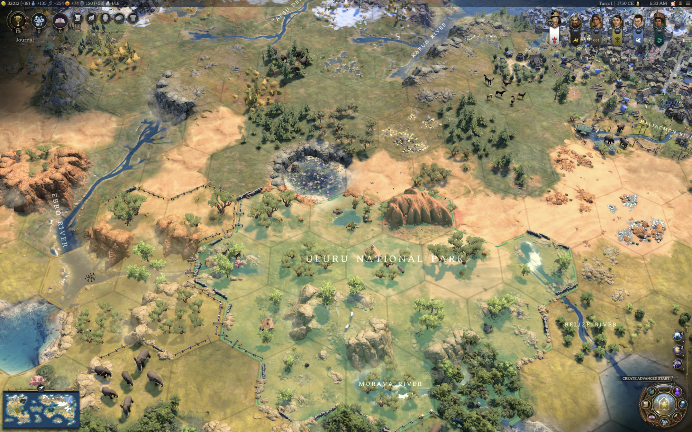 | 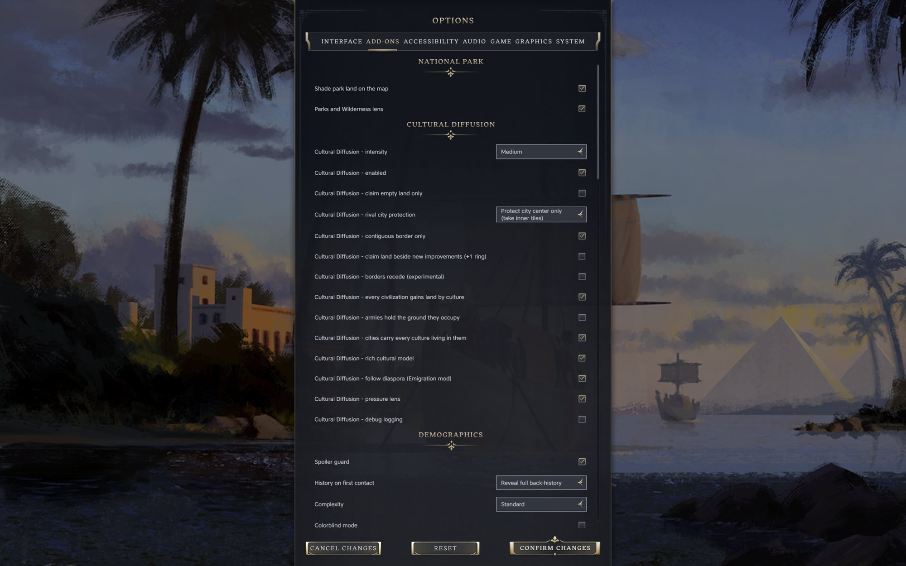 |
| 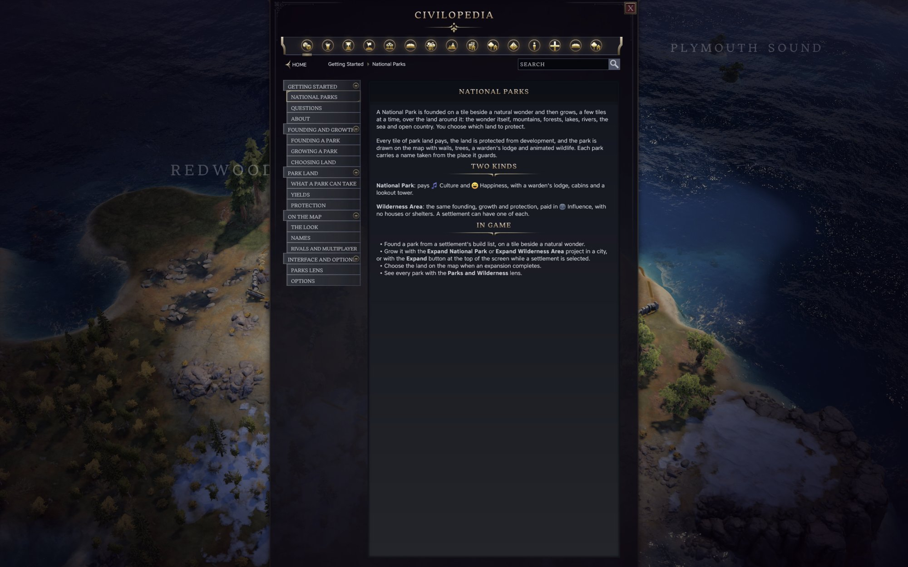 | |

## Multiplayer

- **Hotseat:** everything works. Each player chooses their own park's land on their own turn.
- **Network games:** parks already on the map (from a save) are drawn, shaded by the lens and named for every player,
  with their land protected. New parks are not founded and parks do not grow there: founding and growth place the
  park's pieces by script, which would put the players' games out of step.

## Install

**Steam Workshop:** subscribe, then enable *National Park* under Additional Content.

**Manual:** copy the `national-park` folder into `~/Library/Application Support/Civilization VII/Mods/` (macOS) or
the equivalent Mods folder on your platform, then enable it in-game.

## Compatibility

- Touches no base-game files. Adds two improvements, four land markers (valid for every resource, so park land keeps
  its resources), two projects, one modifier, unlocks on two civics, and icons.
- Placement rules are added to the game's own placement check and removed cleanly, so other mods that change
  placement keep working.
- Park land pays the park's yields only: yields another mod adds to a park tile itself are set aside along with the
  tile's natural ones. Yields a mod adds to a settlement as a whole are untouched.
- Suggested with [Cultural Diffusion](https://github.com/tmtmiller1/civilizationvii-cultural-diffusion): a park grows only into
  land its settlement owns, and Cultural Diffusion's spreading borders give it more land to grow into.
- Works with [Canals](https://github.com/tmtmiller1/civilizationvii_canals): a Canal is never dug through park land, and a
  canal tile cannot join a park.
- Single-player and hotseat games; in a network game parks do not grow (see Multiplayer).
- Built for game version 1.5.0.

## License

MIT, see `LICENSE`.
